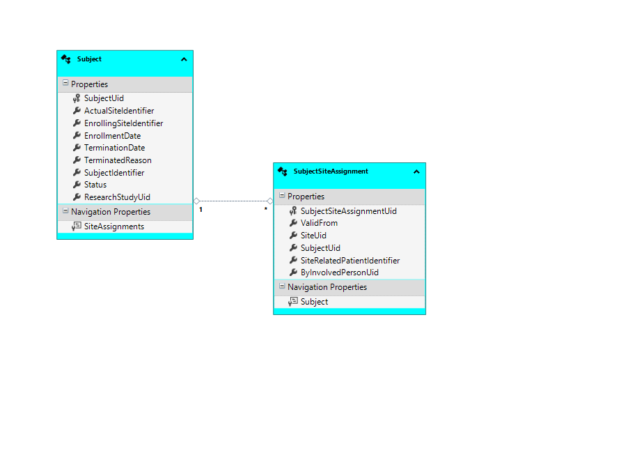

# ORSCF-SubjectData Schema Specification

|          | Info                                    |
|----------|-----------------------------------------|
|author:   |[ORSCF](https://www.orscf.org) ("Open Research Study Communication Formats") / T.Korn|
|license:  |[Apache-2](https://choosealicense.com/licenses/apache-2.0/)|
|version:  |0.1.0|
|timestamp:|2021-11-07 00:00|

### Contents

  * .  [Subject](#Subject)
  * .  [SubjectSiteAssignment](#SubjectSiteAssignment)

# Model:

## Subject

entity, which relates to [HL7.ResearchSubject](https://www.hl7.org/fhir/researchsubject.html)
### Fields

| Name | Type | Required | Fix |
| ---- | ---- | -------- | --- |
| [SubjectUid](#SubjectSubjectUid-Field) **(PK)** | *guid* | YES | no |
| ActualSiteIdentifier | *guid* | YES | no |
| [EnrollingSiteIdentifier](#SubjectEnrollingSiteIdentifier-Field) | *guid* | YES | YES |
| [EnrollmentDate](#SubjectEnrollmentDate-Field) | *datetime* | no | no |
| [TerminationDate](#SubjectTerminationDate-Field) | *datetime* | no | no |
| [TerminatedReason](#SubjectTerminatedReason-Field) | *string* | no | no |
| [SubjectIdentifier](#SubjectSubjectIdentifier-Field) | *string* | no | no |
| [Status](#SubjectStatus-Field) | *string* | YES | no |
| ResearchStudyUid | *guid* | YES | no |
#### Unique Keys
* SubjectUid **(primary)**

#### Subject.**SubjectUid** (Field)

An [Universally Unique Identifier](https://de.wikipedia.org/wiki/Universally_Unique_Identifier) which can be generated by any origin system and is used to address this ORSCF conform data record in decentralized environments. Note that this Identity must not be changed any more!

* this field represents the identity (PK) of the record

#### Subject.**EnrollingSiteIdentifier** (Field)
* after the record has been created, the value of this field must not be changed any more!

#### Subject.**EnrollmentDate** (Field)
* this field is optional, so that '*null*' values are supported

#### Subject.**TerminationDate** (Field)
* this field is optional, so that '*null*' values are supported

#### Subject.**TerminatedReason** (Field)
* this field is optional, so that '*null*' values are supported

#### Subject.**SubjectIdentifier** (Field)
* this field is optional, so that '*null*' values are supported

#### Subject.**Status** (Field)

AS DECLARED BY [HL7.ResearchSubjectStatus](https://www.hl7.org/fhir/valueset-research-subject-status.html):
candidate | eligible | follow-up | ineligible | not-registered | off-study | on-study | on-study-intervention | on-study-observation | pending-on-study | potential-candidate | screening | withdrawn

### Relations

| Navigation-Name | Role | Target-Type | Target-Multiplicity |
| --------------- | -----| ----------- | ------------------- |
| [SiteAssignments](#SiteAssignments-refering-to-this-Subject) | Referers | [SubjectSiteAssignment](#SubjectSiteAssignment) | * (multiple) |

##### **SiteAssignments** (refering to this Subject)
Target: [SubjectSiteAssignment](#SubjectSiteAssignment)

## SubjectSiteAssignment

### Fields

| Name | Type | Required | Fix |
| ---- | ---- | -------- | --- |
| [SubjectSiteAssignmentUid](#SubjectSiteAssignmentSubjectSiteAssignmentUid-Field) **(PK)** | *guid* | YES | no |
| ValidFrom | *datetime* | YES | no |
| [SiteUid](#SubjectSiteAssignmentSiteUid-Field) | *guid* | YES | no |
| [SubjectUid](#SubjectSiteAssignmentSubjectUid-Field) (FK) | *guid* | YES | no |
| [SiteRelatedPatientIdentifier](#SubjectSiteAssignmentSiteRelatedPatientIdentifier-Field) | *string* | no | no |
| [ByInvolvedPersonUid](#SubjectSiteAssignmentByInvolvedPersonUid-Field) | *guid* | no | no |
#### Unique Keys
* SubjectSiteAssignmentUid **(primary)**

#### SubjectSiteAssignment.**SubjectSiteAssignmentUid** (Field)

An [Universally Unique Identifier](https://de.wikipedia.org/wiki/Universally_Unique_Identifier) which can be generated by any origin system and is used to address this ORSCF conform data record in decentralized environments. Note that this Identity must not be changed any more!

* this field represents the identity (PK) of the record

#### SubjectSiteAssignment.**SiteUid** (Field)

[Universally Unique Identifier](https://de.wikipedia.org/wiki/Universally_Unique_Identifier) of the target Site

#### SubjectSiteAssignment.**SubjectUid** (Field)

[Universally Unique Identifier](https://de.wikipedia.org/wiki/Universally_Unique_Identifier) of the target Subject

* this field is used as foreign key to address the related 'Subject'

#### SubjectSiteAssignment.**SiteRelatedPatientIdentifier** (Field)

This can be the ID ('surrogate-key') of the Partient record within a site specific patient management system. This MUST NOT be any natural key or plain readable name which exposes the identity of the patient!

* this field is optional, so that '*null*' values are supported

#### SubjectSiteAssignment.**ByInvolvedPersonUid** (Field)
* this field is optional, so that '*null*' values are supported

### Relations

| Navigation-Name | Role | Target-Type | Target-Multiplicity |
| --------------- | -----| ----------- | ------------------- |
| [Subject](#Subject-lookup-from-this-SubjectSiteAssignment) | Lookup | [Subject](#Subject) | 0/1 (optional) |

##### **Subject** (lookup from this SubjectSiteAssignment)
Target Type: [Subject](#Subject)
Addressed by: [SubjectUid](#SubjectSiteAssignmentSubjectUid-Field).

