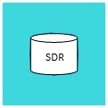

# ORSCF-Specification for the 'SubjectDataRepository' API

 

|          | Info                                                         |
| -------- | ------------------------------------------------------------ |
| author:  | [ORSCF](https://www.orscf.org) ("Open Research Study Communication Formats") |
| license: | [Apache-2](https://choosealicense.com/licenses/apache-2.0/)  |

### Contents:

| File                                           | Description                                                  |
| ---------------------------------------------- | ------------------------------------------------------------ |
| [SDR-Models](./SdrModels.md)                   | Markdown-**Documentation of the domain model** which is defined for this API |
| [Schema.json](./ORSCF-SubjectData.Schema.json) | a json-based representation of the domain model which can be used to generate entities |
| [SDR-Services](./SdrServices.md)               | Markdown-**Documentation of the services** (interface-contracts) which are defined for this API |
| [Swagger-Definition](./swagger.json)           | a json-based [OpenAPI](https://en.wikipedia.org/wiki/OpenAPI_Specification) definition, which can be used to generate client oder server code for REST-APIs |

### see also:

|Specification|Description|Content|
|----|-----------|----|
|[SMS-API](../StudyManagement/readme.md)|Spec. for the 'StudyManagementSystem' API|studies & sites|
|[VDR-API](../VisitData/readme.md)|Spec. for the 'VisitDataRepository' API|research data|
|[BDR-API](../BillingData/readme.md)|Spec. for the 'BillingDataRepository' API|billing data|
|[IMS-API](../IdentityManagement/readme.md)|Spec. for the 'IdentityManagementSystem' API|protected patient identities|
|[WDR-API](../StudyWorkflowDefinition/readme.md)|Spec. for the 'WorkflowDefinitionRepository' API|digital study protocols|
